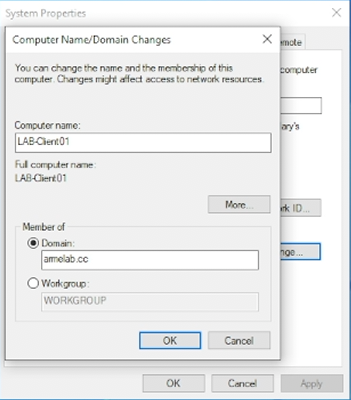
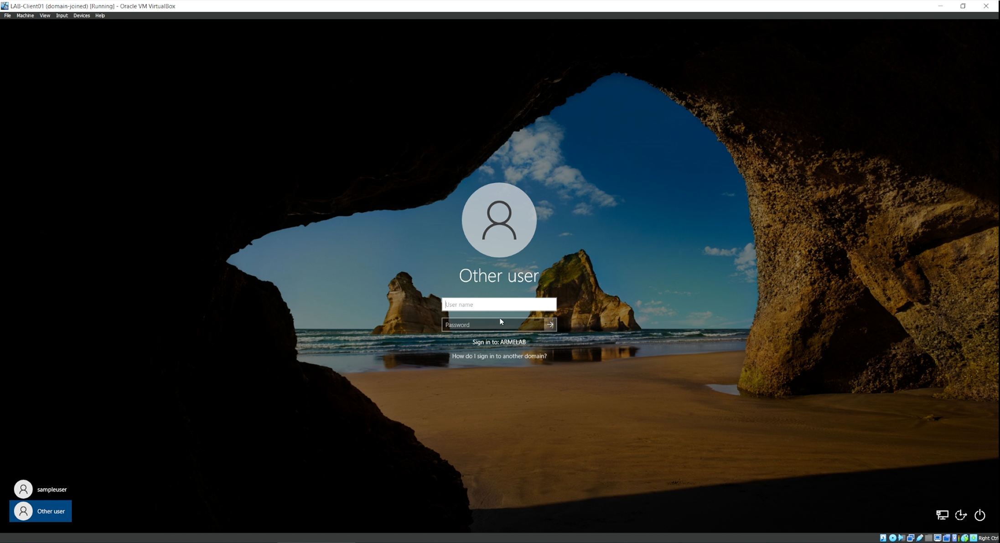

In this post, I will guide you through the steps to create and set up an Active Directory (AD) home lab in a virtual machine environment. The AD lab will simulate an enterprise information system, which I will use to learn cybersecurity operations and conduct penetration testing.

The lab consists of one Windows Server virtual machine acting as a Domain Controller, and two Windows 10 client VMs. The Windows VMs will have Sysmon installed to enhance their event logs. These VMs are created and run on VirtualBox.

Additionally, the lab includes one Kali Linux VM functioning as an attacker machine. This VM will be used to perform penetration testing and generate alerts for a SIEM (Security Information and Event Management) system, which I will set up and implement to the lab  environment later.

## Things needed for the lab
* VirtualBox, or any hypervisor of choice. Download VirtualBox from [here](https://www.virtualbox.org/wiki/Downloads), and install on a host machine.

* Windows Server and Windows 10 ISO files are needed for OS installation on VMs. Here are the links to download both ISO files.
    * [Windows Server 2022 Evaluation](https://www.microsoft.com/en-us/evalcenter/download-windows-server-2022)
    * [Windows 10 Enterprise Evaluation](https://www.microsoft.com/en-us/evalcenter/download-windows-10-enterprise)

* For Kali Linux VM, it can be downloaded as VirtualBox VM [here](https://www.kali.org/get-kali/#kali-virtual-machines).


## Set up Windows 10 client VMs

1. Open up VirtualBox.

2. Click "New" icon, or press Ctrl+N to create a new virtual machine.

3. Name the virtual machine. I named it LAB-Client01. Select folder containing the VM file. Select ISO image file to downloaded Windows 10 Enterprise ISO file. Check Skip Unattended Installation.

    

   For Hardware part, I set the memory to 2 GB and 1 CPU. Leave Hard Disk settings default, then click Finish.

    

4. Run the VM. The Windows 10 installer will start up. Select the language, click Next, then click Install.

    

5. Click Customs: install Windows only.

    

6. Select drive to install Windows. In this case, there is only one unallocated spaced. Go ahead and click Next.

    

7. The Windows is being installed. Wait until the installation is finished.

8. Once it is finish, restart the computer, or let it restart itself after 10 seconds.

9. Once it is restarted, the Out-of-the-Box (OOBE) screen will show up. Choose region and keyboard layout. Skip the second keyboard layout setup, and proceed.

    

    

10. The setup will ask you to log in with Microsoft account. Click Domain join instead.

    

11. Put in username and password for local user. For security questions, select random questions and put in '-' as answer for all questions.

12. Choose No for all privacy settings.

13. Wait until Windows finish starting up.

14. (Optional - install VirtualBox Guest Additions) In the VM menu bar, go to Devices > Insert Guest Additions CD Image. In Windows VM, open file explorer, open D:\ drive , and run VBoxWindowsAdditions-amd64 executable file. Complete the Guest Additions installation, then reboot the VM.

    

    

    

    By default, the VM desktop size will remain the same, even thought the VM window is resized or maximized. With VirtualBox Guest Additions installed, the VM desktop will always fit the window size.

15. Rename the hostname to LAB-Client01.

16. Repeat step 1-15 to create and set up another Windows 10 client VM. Name the VM and hostname to LAB-Client02 on the second client VM.

## Set up Windows Server VM

1. Create a VM in VirtualBox, name the VM to LAB-ServerDC, select ISO image file to the Windows Server ISO file. Be sure to check Skip Unattended Installation.
Configure hardware to 2 CPUs and 4GB memory. Leave Hard Disk settings default, and click Finish.

   

2. Run the VM to begin Windows Server installation process.

3. Select language to install, then click Next.

4. Select edition to Windows Server 2022 Standard Evaluation (Desktop Experience) so the Windows Server will be installed with GUI. Then, click Next.

    

5. Select disk partition to install.

6. Wait until the installation is finished. Once it is done, restart the VM.

7. On Customize settings screen, set password for the Administrator account.

    

8. On lock screen, press Right Ctrl and Delete keys to send Ctrl+Alt+Del input, then put in password for Administrator when prompted.

    

9. (Optional) Install VirtualBox Guest Additions.

## Install Sysmon on all Windows VMs

1. Run PowerShell as administrator on one of the Windows VMs.

2. Change directory to Downloads folder (C:\Users\<username>\Downloads).

3. Download Sysmon installer ZIP file and unzip the file by running these command lines.

    ```powershell
    IWR -Uri https://download.sysinternals.com/files/Sysmon.zip -OutFile .\Sysmon.zip
    Expand-Archive -Path .\Sysmon.zip -DestinationPath .\Sysmon
    ```
4. Open the folder containing Sysmon installer file in File Explorer, then download Sysmon configuration file by Olaf Hartong to the folder from [here](https://raw.githubusercontent.com/olafhartong/sysmon-modular/master/sysmonconfig.xml).

5. In PowerShell, change directory to the folder containing both Sysmon installer and  sysmonconfig.xml, and run the command below to install Sysmon on Windows VM.

    ```powershell
    .\Sysmon64 -i .\sysmonconfig.xml
    ```
    The license agreement dialogue will show up. Click Agree to continue Sysmon installation process.

6. After the installatiion is completed, verify that Sysmon64 service is running by opening Services (start menu, then type in "services"). Scroll down the list and see if Sysmon64 service is listed and running.

    

7. Repeat step 1-7 on other two Windows VMs.

## VirtualBox NAT network

1. In VirtualBox Manager, go to File > Tools > Network Manager.


2. Select NAT Networks tab, then click Create to create a NAT netowrk for the AD lab.

3. Name the NAT Network lab. For this example, I named it AD-Lab. Configure the IPv4 prefix. I configured it 192.168.100.0/24. Check Enable DHCP, so IPv4 configuration will be configured automatically on all VMs connected to the network, unless a VM's IPv4 is configured manually.

    

4. Connect all VMs to the AD-Lab NAT Network.

## Install Active Directory Domain Service (AD DS) on the Windows Server VM

1. In Windows Server VM, open Server Manager.

2. On the top right, click Manage > Add Roles and Features.

    

3. In Add Roles and Features Wizard window, click Next, then select Role-based installation, then click Next.

    

4. Select server, then Next.

5. In Server Roles, check Active Directory Domain Service.

    
    
    Then, click Add Features to add features required for AD DS.

    
    
    After that, click Next.

6. Click Install, and wait until it says "Installation succeeded", then close the window.

    

## Promote the Windows Server VM to a Domain Controller

1. After finish installing AD DS, in Server Manager, click the flag icon, and click Promote the server to a domain controller.

    

2. The AD DS configuration wizard will appear. In Deployment Configuration, select Add a new forest, then put in root domain name. For this lab, I put in armelab.cc, and Next.

    

3. Put in Directory Services Restor Mode (DRSM) password, leave other settings default, then Next.

    

4. Keep clicking Next until Prerequisite Chcek, then click Install.

    

5. Once the installation is finished, the VM will restart it self in a minute. After restarting, unlock the lock screen (Right Crtl+Alt). The login prompt will be shown with the domain name. That means the Windows Server machine is now a Domain Controller.

    

## Create AD domain users

1. In Windows Server VM, open Active Directory Users and Computers.

2. Right click at the domain name on the left pane, then go to New > Organizational Unit (OU).

    

3. Name the new OU, then click OK.

4. Right click at the new OU, then go to New > User.

5. Put in user's first name, last name, and user logon name, then Next.

6. Put in the user's password. Uncheck User must change password at next logon, then Next.

7. A confirmation dialogue will show up. Click Finish to create a domain user.

8. Repeat the steps to create another domain user.

## Join client VMs to the domain

1. On Windows 10 client VM, configure DNS server address to the IP address of the domain controller.

    

2. In a Windows 10 client VM, go to Start menu > Settings, then select System.

3. In System settings, on the left pane, scroll all the way down and click About. On the right had side, click Advanced computer settings. The System Properties window will show up.

4. In System Properties, select Computer Name tab, then click Change to move the VM to the domain.

5. In Computer Name/Domina Changes dialogue, select Member of domain, and put in the domain name, then click OK.

    

6. Restart the VM.

7. After the restart, in the lock screen, click Other User at the bottom left. The log in prompt will show Sign in to: \<domain name\>. It means the VM has been joined to the AD domain.

    

8. Log into the VM as a domain user.

## What's next?

Next step, I will implement Wazuh SIEM and EDR platform to the lab. Wazuh will be hosted on a cloud VM, because resources on my host machine is limited. In next post, I will demonstrate how I set up Wazuh SIEM on a cloud-based VM and put it to use with the AD lab environment.