Vulnerabilitty scanning is a process that is a part of vulnerability management. The purpose of vulnerability scanning is to discover vulnerabilities, or weaknesses on an organization's assets.

In this post, I am going to demonstrate steps I took to set up, configure, and run vulnerability scanning on my Active Directory domain clients. This post also includes how to remediate discovered vulnerabilities.

## Installing Tenable Nessus on Kali Linux VM

1. In Terminal, ```cd``` to Downloads folder, then run this command to download Tenable Nessus .deb package.

    ```bash
    curl --request GET \
    --url 'https://www.tenable.com/downloads/api/v2/pages/nessus/files/Nessus-10.7.3-debian10_amd64.deb' \
    --output 'Nessus-10.7.3-debian10_amd64.deb'
    ```
2. Install Tenable Nessus on the Kali Linux VM using this command.

    ```bash
    sudo dpkg -i Nessus-10.7.3-ubuntu1404_amd64.deb
    ```
3. Restart ```nessusd``` daemon.
    
    ```bash
    systemctl restart nessusd
    ```

## Nessus initial configuration

1. Open up web browser,then go to https://localhost:8834. It will show "Welcome to Nessus" page. Click Continue.

2. Select "Register for Nessus Essential", then Continue.

    

3. Go to https://www.tenable.com/products/nessus/nessus-essentials, and put in first name, last name, and email address to register and receive Nessus Essential activation code via email.

4. Back to Nessus configuration. Click Skip on "Get an activation code" page, put in activation code sent via email, and Continue.

    

    

5. Set username and password to create Nessus administrator account, then Submit.

    

6. Wait for the Nessus to finish configuration. Once it is done, you will be logged into Nessus. Wait until Nessus finish compiling plugins.

## Prior to starting scanning

Before I started scanning for vulnerabilities on those client VMs, I ran Windows Update  to install latest update on one of the clients. The point is to compare the vulnerability scanning results between the updated client and the outdated one. 

## Running a scan - without credentials

1. In Nessus app page, click New Scan, then select Basic Network Scan template.

2. Name the scan. For Targets field, put in IP address of my Windows VM, splitted by commas. Save the scan.

    

    Set Discovery Scan Type to **Port scan (all ports)**

    

3. Click play button to start scanning.

    

4. Wait until the scan is completed.

## First scan result

Here is the result of regular, non-credentialed scan. It did not find any vulnerability on target devices. Only information of both client VM are presented.


In order to be able to discover vulnerabilities on those VMs, I need to run credentialed scan, because Nessus needs additional access on target devices to be able to discover vulnerabilities.

## Setting up environment for credentialed scan

Before beginning credentialed scan, the AD lab environment needs to be configured for Nessus to be able to perform credentialed scan and discover vulnerabilities that non-credentialed scan cannot. 

I read the [Nessus documentation](https://docs.tenable.com/nessus/10_7/Content/CredentialedChecksOnWindows.htm) and learned how to set up Windows environment for credentialed scan. Here are steps I took to get the AD domain ready for credentialed scan. These steps were taken on the Domain Controller, except the Group Policy update step, which was done on the client VMs.

* Create an account with administrator privilege.
* Create Nessus security group and a Group Policy Object (GPO) for Nessus scan.
* Add Nessus security group to the GPO.
* Configure the GPO as follow: 
    * Allow WMI, File and Printer Sharing through Windows Firewall.
    * Set local security settings to allow domain users to authenticate as themselves.
    * Create **LocalAccountTokenFilterPolicy** registry key.
    * Enable **Remote Registry** service.
* Link the GPO to the domain, update Group Policy on each client VM.

### Creating privileged account for Nessus credentialed scan

1. Open Active Directory Users and Computers.

2. Create a domain user.

3. Add the user to group **Builtin/Administrators**.

### Creating Nessus Local Access security group

1. In Active Directory Users and Computers, create new group named Nessus Local Access.

2. Select group scope to **Global**, and group type to **Security**.

3. Click OK. 

    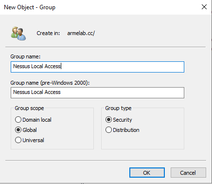

### Creating Nessus Scan GPO

1. Open Group Policy Management console (gpmc.msc).

2. On the left pane, right click Group Policy Objects folder, then click New.

    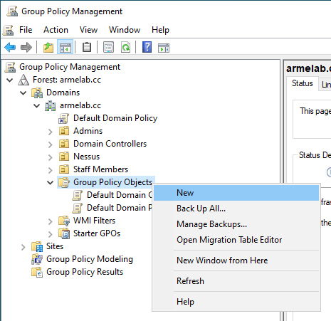

3. Name a new GPO Nessus Scan GPO.

    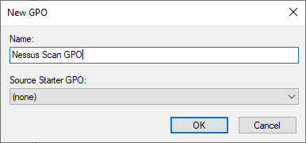

4. Click OK.

### Editing Nessus Scan GPO

1. Right click the Nessus Scan GPO, then click Edit.

    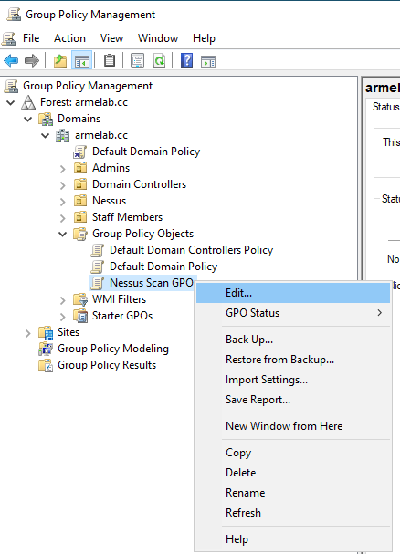

2.  The Group Policy Management Editor for the GPO will show up. Configure the GPO as follow.

#### Configuring security model for local account

* Under **Computer Configuration** > **Policies** > **Windows Settings** > **Security Settings** > **Local Policies** > **Security Options**, set **Network access: Sharing and security model for local accounts** to **Classic - local users authenticate as themselves**.

#### Adding Administrators group to the GPO

* Under **Computer Configuration** > **Policies** > **Windows Settings** > **Security Settings**, right click **Restricted Groups**, then click **Add Group...**.

    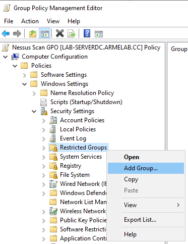
* Browse  **Nessus Local Access** group, then OK.
* At **This group is a member of:**, add **Administrators** (Builtin/Administrators) group. 
* Click Apply and OK.

    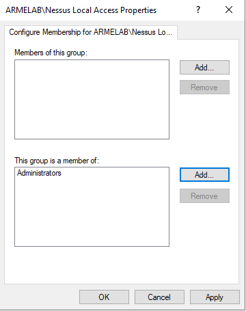

#### Allowing Windows Management Instrumentation (WMI) through firewall
* Under **Computer Configuration** > **Policies** > **Windows Settings** > **Security Settings** > **Windows Defender Firewall with Advanced Security** > **Windows Defender Firewall with Advanced Security**, right click **Inbound Rules**, then click **New Rule...**.

    

* Select **Predefined**, choose **WMI**, then **Next**.

    

* Click **Next**, select **Allow the connection**, and **Finish**.

    

    


#### Allowing File and Printer sharing through firewall
* Create a new inbound rule for Windows Firewall.
* Select **Predefined** > **File and Printer Sharing**, then click Next twice.

    

* Select **Allow the connection**, then **Finish**.

#### Creating LocalAccountTokenFilterPolicy registry key
* Under **Computer Configuration**, **Preferences**, **Windows Settings**, right click **Registry**, then click **New** > **Registry Item**.

    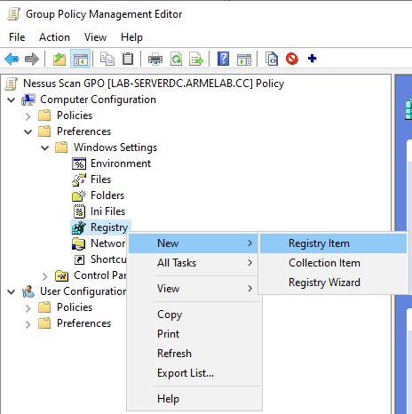

* Set the new registry item properties:
    * Action: Create
    * Hive: HKEY_LOCAL MACHINE
    * Key Path: SOFTWARE\Microsoft\Windows\CurrentVersion\Policies\system
    * Value name: LocalAccountTokenFilterPolicy
    * Value type: REG_DWORD
    * Value data: 1
    * Base: Decimal
* Click Apply then OK.

    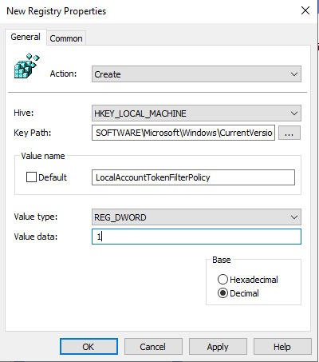

#### Enabling Remote Registry service
* Under **Computer Configuration**, **Preferences**, **Control Panel Settings**, right click **Services** > **New** > **Service**.

    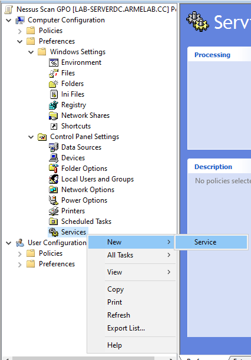

* Set the new service properties:
    * Startup: Automatic
    * Service name: RemoteRegistry
    * Service action: Start service
* Click Apply and OK.

    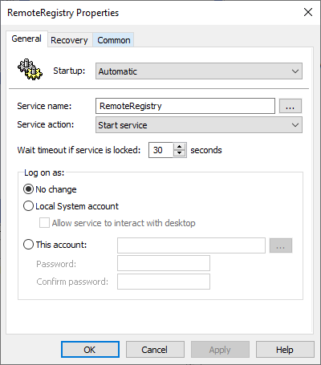

### Linking Nessus Scan GPO to the lab domain

1. In Group Policy Management console, right click the domain, then click **Link an Existing GPO...**.

    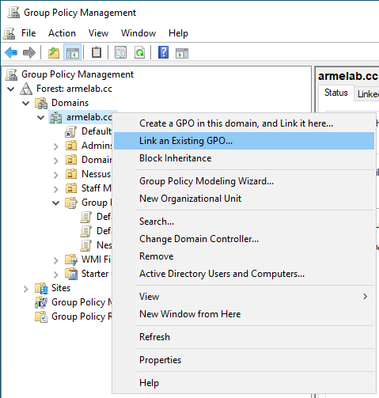

2. Select **Nessus Scan GPO**.

    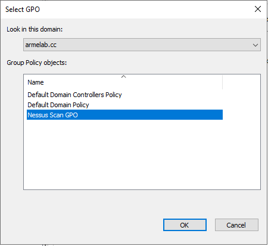

3. Click OK.

### Updating Group Policy on client VMs

1. Log into a Windows 10 client VM.

2. Open ```cmd```, then run ```gpupdate /force``` command.

3. Wait for it to complete updating policy.

    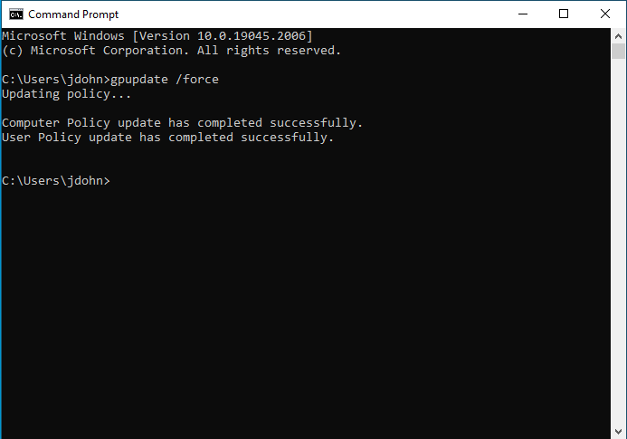

## Configuring credentialed scan in Nessus

1. Log into Nessus dashboard.

2. Click the existing scan, then click Configure.

3. Go to Credentials tab, and select credential type to Host > Windows.

4. Set authentication method to Password. Put in username, password, and domain name. The credentials are the one created specificially for Nessus scan with administrator previlege on local computer.

    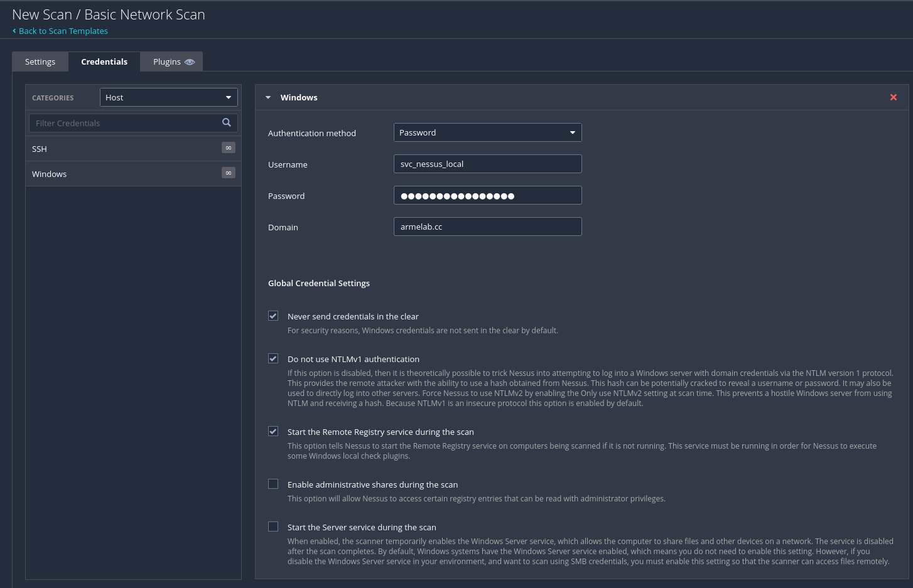

5. Check **Start the Remote Registry service during the scan**.

6. Save the scan settings.

7. Run the scan again, and wait until the scan is completed.

## Credentialed scan result

Here is the result after the credentialed scan is completed. 12 Critical, 17 High, and 1 Medium vulnerabilities are discover on endpoint 192.168.100.6. On 192.168.100.5, only 1 High and 1 Medium vulnerabilities are discovered. This is because I ran Windows Update only on client 192.168.100.5.

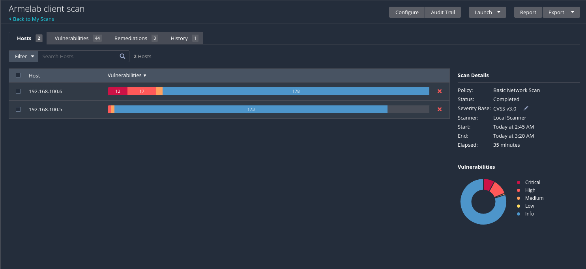

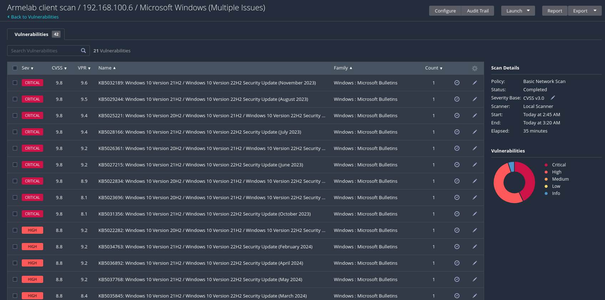

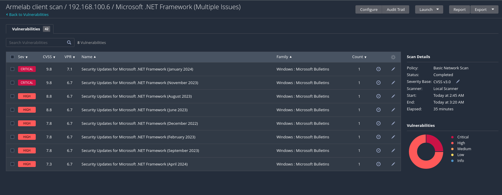

There are some vulnerabilities that could not be remediated by running Windows Update. WinVerifySignature CVE-2013-3900 vulnerability can be remediated by creating **EnableCertPaddingCheck** registry keys on client computers, and SMB siging policy needs to be applied to remediate "SMB signing not required" vulnerability.

## Remediating vulnerabilities

* To remediate Windows Security update and .NET Framework Security update vulnerabilities, run Windows update and restart VM twice, because some of the latest updates require some previous updates that is missing prior to the first run of update. Repeat the update process until it says "Your Windows is up to date".

* Haxx Curl vulnerability can be remediated by installing latest Windows updates. The later version of **curl** is included in Windows update.

* To remediated WinVerifySignature CVE-2013-3900 vulnerability, create EnableCertPaddingCheck registry keys in ```HKLM\Software\Wow6432Node\Microsoft\Cryptography\Wintrust\Config\``` and ```HKLM\Software\Microsoft\Cryptography\Wintrust\Config```. Set the **DWORD** value to 1.

* Enable SMB signing by enabling 4 policy items in a GPO:
    * Microsoft network server: Digitally sign communications (always)
    * Microsoft network server: Digitally sign communications (if client agrees)
    * Microsoft network client: Digitally sign communications (always)
    * Microsoft network client: Digitally sign communications (if server agrees)

    These policy items are under **Computer Configuration** > **Policies** > **Windows Settings** > **Security Settings** > **Local Policies** > **Security Options**. Once policy items are modified, link the GPO to domain to apply policies.

## Running the scan again to verify the remediation

After remediating the vulnerabilities discovered on the Windows clients, I ran the scan again to verify that the vulnerabilities are gone.

The result is out, no vulnerability detected on those two clients. Only device information is shown in the scan report. That means the vulnerabilities were successfully remediated.

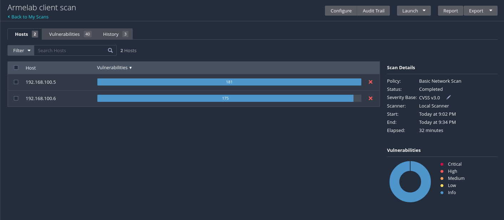

