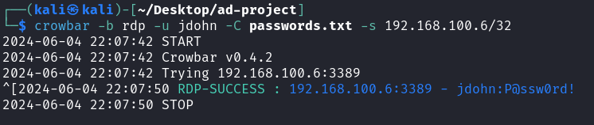
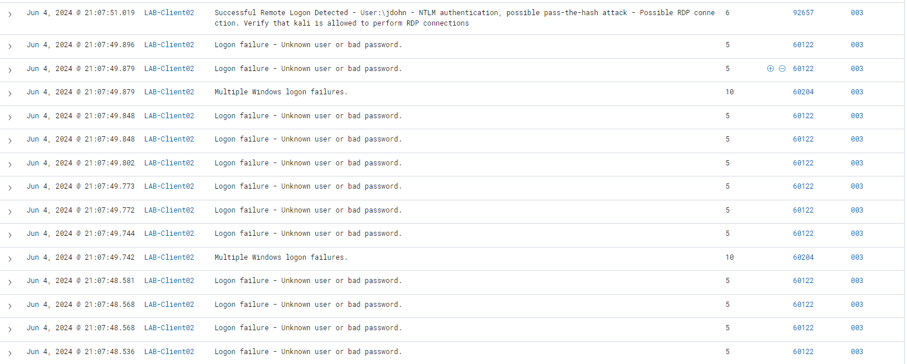
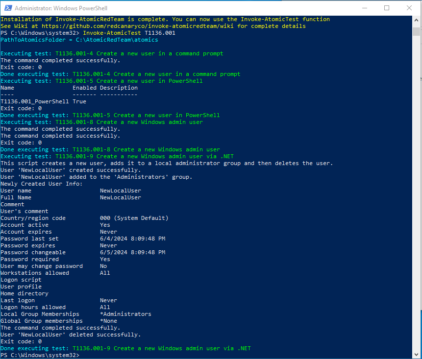
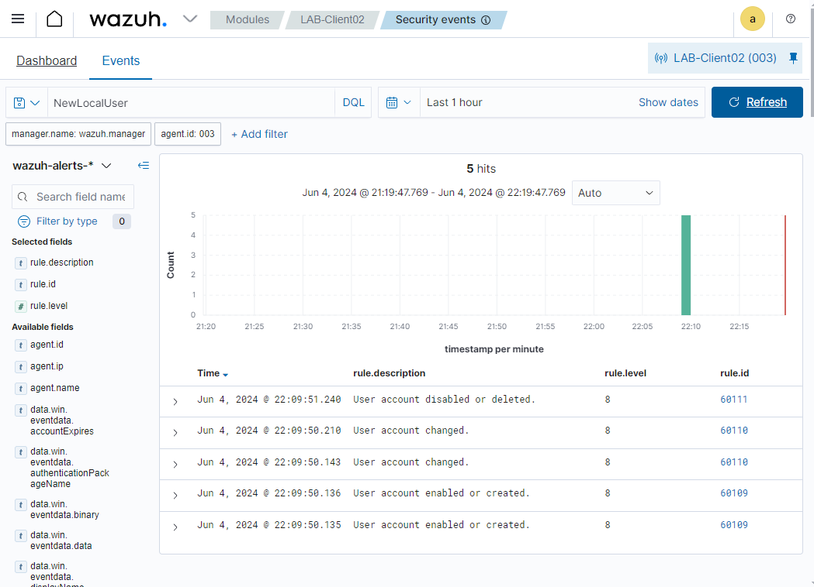

In my previous post, I set up Wazuh security information and event mangement (SIEM) on a cloud virtual machine (VM), and implemetnmed it to my Active Directory domain on a virtual machine environement on my local computer.

Now it is time to get the Wazuh SIEM to work. In this post, I am going to generate telemetry on a Windows 10 virtual machine by conducting brute force attack via Remote Desktop Protocol (RDP), as well as running adversary emulation using Red Team Atomic.

## Setting up target VM

### Allowing RDP connection
Remote Desktop connection must be allowed on the target Windows VM to be able to do brute force attack via RDP protocol.
1. On target Windows 10 VM, press ```Windows Key``` + ```R```, put in ```systempropertiesadvanced.exe```, then OK to open Advanced System Properties. This requires administrator credentials.

2. Go to Remote tab. In Remote Desktop section, select **Allow remote connections to this computer**.

3. Click **Select Users...**, then add domain users to the list of users allowed to connect to the target machine via RDP.

4. Click OK.

### Excluding C: drive on Windows Defender
C: drive needs to be excluded from Windows Defender real-time scanning in order to be able to install Red Team Atomic. Otherwise, Red Team Atomic will be blocked by Windows Defender, resulting in installation failure, unable to run adversary emulation.

1. Open Start menu, then search "Windows Security". Open Windows Security.

2. Go to **Virus & threat protection** on the left pane. Under **Virus & threat protection settings**, click **Manage settings**.

3. Scroll down to Exclusions, then click **Add or remove exclusions**.

4. Click **Add an exclusions**, then select Folder.

5. Select **C:\\** drive.

## Running RDP brute force attack
### Getting password list ready
1. On Kali Linux VM,  ```cd``` to ```/usr/share/wordlists```.

2. Run this command to unzip ```rockyou.txt.gz``` file.
    ```bash
    sudo gunzip rockyou.txt.gz
    ```
    ```rockyou.txt``` is a password list file commonly used for password attack, like brute force, or dictionary attack. The file contains massive amount of passwords, and the fiel size is large. For the demonstration, I will be only use 50 of passwords from ```rockyou.txt```, and make it a new text file.

3. Create a folder to contain the ```rockyou.txt``` file, then copy ```rockyou.txt``` to the folder.

4. Run this command to read first 50 line of ```rockyou.txt``` and write it to a new text file named ```passwords.txt```.
    ```bash
    head -n 50 rockyou.txt > passwords.txt
    ```
5. Open ```passwords.txt``` using ```nano```, add a valid password of a user of my lab domain, then save the file.

### Installing and Running Crowbar
Crowbar is a tool used for brute force attack. Crowbar supports OpenVPN, Remote Desktop Protocol, SSH Private Keys and VNC Keys. In this demo, I am going to use Crowbar for RDP brute force attack.

1. Run this command to install Crowbar.
    ```bash
    sudo apt-get install -y crowbar
    ```
2. After Crowbar is installed, use this command to run brute force attack on a target host via RDP protocol using password list.

    ```bash
    crowbar -b rdp -u <username> -C passwords.txt -s <target IP address>/32
    ```
    For example, I want to find out password for username **jdohn** on target machine 192.168.100.6 using ```passwords.txt``` for password list. The command looks like this.
    ```
    crowbar -b rdp -u jdohn -C passwords.txt -s 192.168.100.6/32
    ```
    If the run is successful, it will show password of **jdohn** in the result.

    

## Detecting brute fore attack on Wazuh
1. Log in to Wazuh Manager.

2. Look into an agent that is targer for the brute force attack, then click Security Event.

3. Click Events to view logs and alerts on the target VM. 

    
    
    Notice that there are multiple "Logon failure" events listed. Those events occur at about the exact same time, only miliseconds different within 50 attempts. It means there is a brute force attack targeting the host.

    Also, there is one log entry saying "Succesful Remote Logon Detected". That event happens the same time the brute force attack occurs. It indicates that the password has been discovered by the brute force attack.

## Running Atomic Red Team on Windows VM

In this section, I am going to gun Atomic Red Team to emulate attacks mapped to MITRE ATT&CK techniques. This is for me to learn about identifying Tactics, Techniques, and Procedures (TTP) used by adversaries.

1. Open PowerShell as administrator.

2. Before installing Red Team Atomic, Execution Policy must be set to Bypass.
    ```powershell
    Set-ExecutionPolicy Bypass CurrentUser
    ```
    Type "Y" then hit Enter when prompted to change the execution policy.

3. Run these commands to install Atomic Red Team.
    ```powershell
    IEX (IWR 'https://raw.githubusercontent.com/redcanaryco/invoke-atomicredteam/master/install-atomicredteam.ps1' -UseBasicParsing);
    Install-AtomicRedTeam -getAtomics
    ```
    Type "Y" then hit Enter when prompted for installing NuGet provider.

4. Run ```Invoke-AtomicTest [MITRE ATT&CK technique ID]``` command to run attack emulation. Attacks are mapped to MITRE ATT&CK techniques. Go to [attack.mitre.org](https://attack.mitre.org) to see list of techniques in the ATT&CK Matrix for Enterprise.

    In this demo, I am going to emulate a technique called Create Account. This technique is a part of Persistence tactic, and it is used by adversaries to maintain access to victim systems. The MITRE ATT&CK technique ID for Create Account is T1136, and there are 3 sub-techniques. I choose T1136.001, which is Local Account. I am going to run the emulation of the local account creation using this command.

    ```powershell
    Invoke-AtomicTest T1136.001
    ```
    

    From the run result, an account named **NewLocalUser** is created. Let's go to Wazuh manager and look for account creation event.

## Looking for account creation events to identify Persistence tactic
1. Go to Wazuh Manager > Security Events of the VM that the emulation was run on.

2. In the search bar, type in "NewLocalUser" to see only events containing NewLocalUser.



    There are five event entries that has NewLocalUser. If looking into details of each entry, they show that an account *NewLocalUser** is created and added to local Administrators group.

## What's Next
Next steps, I am going to run some more attack emulations with different techniques. Also, I am going to create custom rules in Wazuh for better detection.