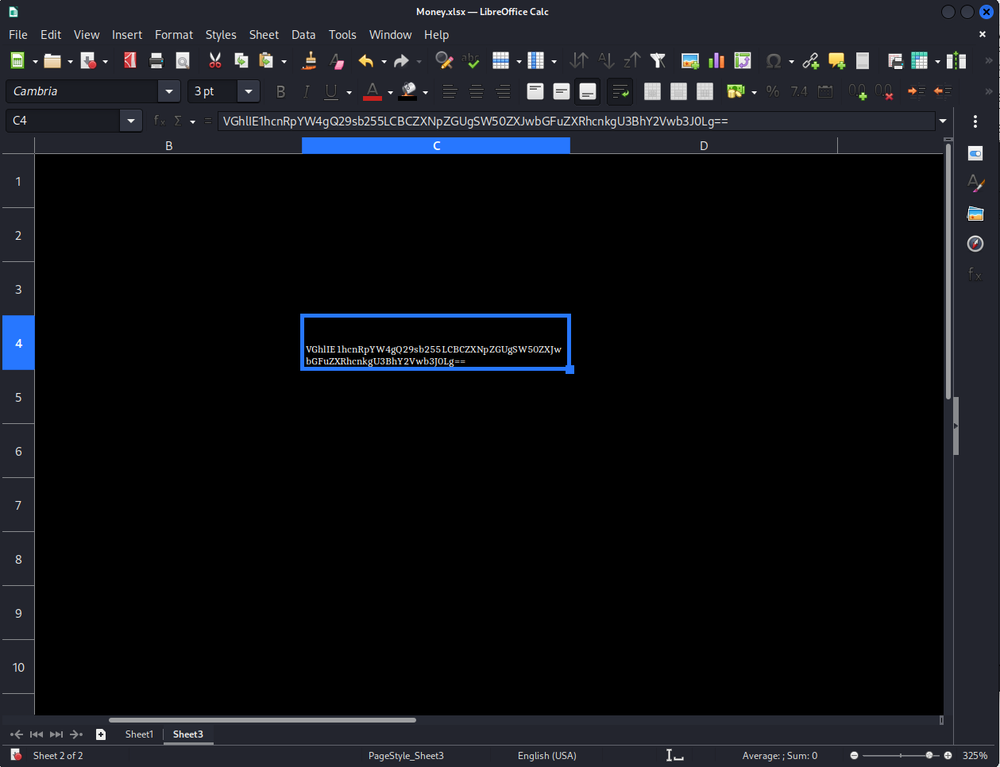

This post demonstrates how I completed Blue Team Labs Online challenge, The Planet's Prestige, along with explanations on challenge submission answers. This challenges requires email and file analysis skills to find correct answers and complete the challenge. For me, this is good and fun way to learn more about email and file analysis.


## Scenario

The challenge provides following scenario...
```
CoCanDa, a planet known as 'The Heaven of the Universe' has been having a bad year. A series of riots have taken place across the planet due to the frequent abduction of citizens, known as CoCanDians, by a mysterious force. CoCanDa’s Planetary President arranged a war-room with the best brains and military leaders to work on a solution. After the meeting concluded the President was informed his daughter had disappeared. CoCanDa agents spread across multiple planets were working day and night to locate her. Two days later and there’s no update on the situation, no demand for ransom, not even a single clue regarding the whereabouts of the missing people. On the third day a CoCanDa representative, an Army Major on Earth, received an email. 
```

Also, an email file (.eml) is provided in the challenge. This email file is the challenge material used to find answers for challenge submissions.

To be safe, I did the challenge on a VM because I was afraid it might contain malicious stuffs in downloaded file. I then opened the email file in a text editor and analysed it.


The email contains a lot of information, including header, as well as the email body and an attachment file, both encoded in Base64.


## Challenge submission

### What is the email service used by the malicious actor?

The email header contains information of the source of the email. The sender email address is **billjobs(at)microapple.com**, which is, obviously, fake.

I looked into **Receive-SFP** parameter. It says **fail**. Also, it contains an IP address of the sender, 93.99.104.210. This must be the source of the email.

I also found the same IP address in **Recieved: from** part. It shows domain name (emkei.cz) along with the sender's IP address. I learned that emkei.cz is a fake mailer service website. So, the email was sent using the fake mailer service.

The answer is **emkei.cz**.

### What is the Reply-To email address?

The Reply-To email address is in the email header. It is listed as **Reply-To: negeja3921@pashter.com**.

The answer is **negeja3921@pashter.com**.

### What is the filetype of the received attachment which helped to continue the investigation?

First, let's take a look into the email body message.

I copied Base64-encoded message into [CyberChef](https://gchq.github.io/CyberChef/) and put it into Input field. I then dragged **From Base64** to the Recipe, and let it cook.


The message was decoded. It told me to solve puzzle sent as an attachment file with a hint "Don't Trust Your Eyes".

From the email, the attachment was in PDF format. I then got the attachment part of the email decoded, and saved it as a PDF file. I attempted to open the PDF file, but it gave an error saying... 

"Unable to open document
File type Zip archive is not supported"


The file was not a PDF file. It could be a ZIP file as the error said. So, I used a tool called ```hexdump``` to inspect file signature to determine the file type.

File signature, also known as "magic numbers", are first few bytes of a file used to identify and verify the file type.


The first 4 bytes of the file are ```50 4b 03 04```.

I then looked up for the file signature bytes in [Gary Kessler's File Signature Table](https://www.garykessler.net/library/file_sigs.html) and found out that those bytes are the signature of ZIP file. I confirmed that the attachment file is a ZIP file, so I changed the extension of the attachment from .pdf to .zip. I was able to open the ZIP file and extract 3 files inside it.


The answer is **.zip**.

### What is the name of the malicious actor?

From those 3 extracted files, there was one PDF file containing a message to me. I then opened the file. The message implied that the location is in **money.xlsx** Excel spreadsheet file.

To find out the name of sender, I inspected the metadata of those 3 files using **Exiftool** and look for author of the files.

That was the PDF file containing the name of the author, **Pestero Negeja**, which is most likely the sender of the file and email. Also, the name was associated with the Reply-To email address, negeja3921@pashter.com.

The answer is **Pestero Negeja**.

### What is the location of the attacker in this Universe?

From the hint in PDF file message, it said the location is in **money.xlsx**. I then opened the spreadsheet file using LibreOffice Calc.


The message said "it is fake", but the spreadsheet file has another sheet, Sheet 3. The Sheet 3 might contain the answer I was looking for, so I opened the sheet. The sheet appeared blank, but I thought it might have hidden something in it, otherwise there would not be the another sheet in the file in the first place. I tried filling dark color in an entire sheet, then the message was revealed.



It was a Base64 encoded message. I copied and pasted it in CyberChef to decode and got the location.


The answer is **The Martian Colony, Beside Interplanetary Spaceport**.

### What could be the probable C&C domain to control the attacker’s autonomous bots?

The name of the malicious actor, Pestero Negeja, is correlated with the email address, negeja3921@pashter.com. The domain of the email address could be the address of the the attacker's C&C server domain.

The answer is **pashter.com**.

## Challenge Completed


In this challenge, I learned more about email header anlysis to determine if an email is spoofed. Also, I learned more about file signature analysis to verify the file content/type. I had fun going through the challenge as I learned few more things.